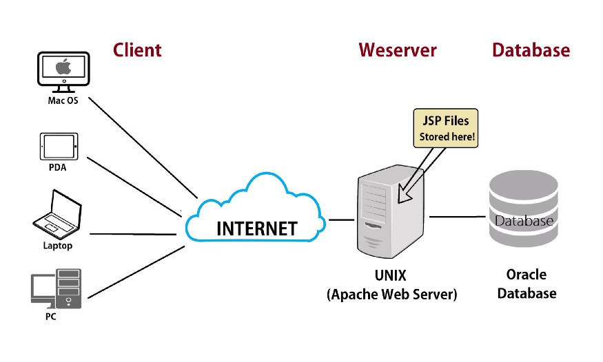

## Internet Infrastructure

The internet is a network of Cables that facilitates the transmission of “Data Packets”

>The network of cables is vast and spans the Globe more than 550,000 miles of hidden cable under the Ocean. Reported by Business Insider 

## Data Packets

Contains the Information being transmitted over a Network. Data packets can include **Emails, Files, or Web Pages**. They also include information about the **Sender** and a **Recipient**. Recipient is a Device attached to the Network. The Address of the Device is defined by it’s **IP (Internet Protocol) Address**. Every Device attached to the Network has a **Unique IP Address**.

An IP address is a string of Numbers separated by periods.

>Example : The IP Address of the Web Server hosting Google.com is 74.125.224.72

## Bandwidth

The speed at which packets can be transmitted. Bandwidth transmission Capacity is measured by bit rate. Bit rate is the number of bits per second a digital network can transmit.

> **Latency** : Amount of time it takes for 1 bit to be sent from the Sender to Receiver.

## Protocol

A well-established set of rules and standards used to communicate between machines.

- **IP (Internet Protocol)** : Route information to the proper address.
- **TCP Protocol** : Facilitates the transmission of Data Packets. Ensures no information is missing.
- **HTTP/HTTPS Protocol** : Facilitates communication between a web browser and web server.

## Web Server

A computer that hosts a website or Web Application. Configured to accept remote connections with internet users and relay data through HTTP/HTTPS.

HTTPS Protocol : More secure than HTTP. Data packets are Encrypted using SSL or TLS.

### SSL : Secure Socket Layer, TLS : Transport Security Layer

SSL created with a Security Certificate.

### Security Certificate

Requires installation on the web server. Can be purchased from a reputable vendor. Validation requires information about the Domain and Registrant. EV Certificates offer the highest level of Security.

### SMTP (Simple Mail Transfer Protocol)

SMTP Email server handles Outgoing Mail Delivery. Two types of Mail Delivery. They are **Local & Outbound.**

# The Web Development Process

01. Plan & Create a Flow Diagram of the Web Application.
02. Determine your system requirements & hosting solutions.
03. Choose a domain name and Register.
04. Setup a Local Testing Server.
05. Setup a Production server.
06. Setup your FTP services.
07. Develop the Front-End of your web application using HTML, CSS, Bootstrap, JavaScript jQuery.
08. Database Setup / Configuration (MySQL/PhpMyAdmin).
09. Dynamic Web Interactivity (PHP).
10. Upload your website using FTP services.
11. Configure DNS Record.
12. Configure custom Emails Address on your domain

## Planning a website

Establish the purpose of your Website

## Static or Dynamic ?

> Examples
> https://www.nestle.lk/
> https://www.amazon.com/

