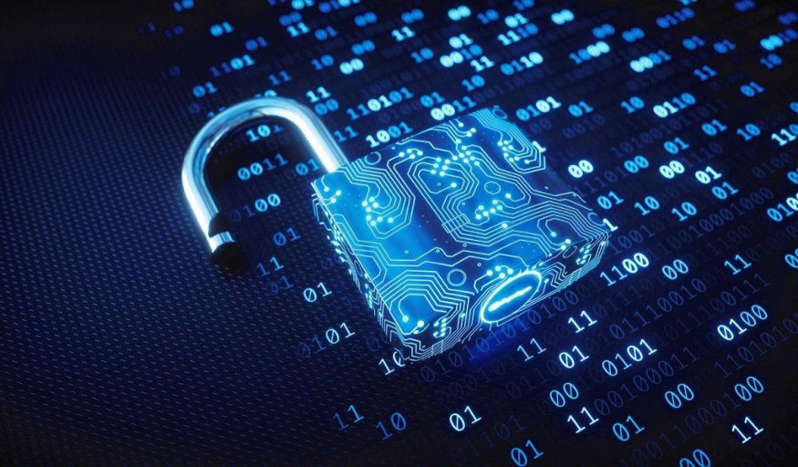

Cyber security refers to the body of technologies, processes, and practices designed to protect internet-connected systems such as hardware, software and data from cyber threats. The practice is used by individuals and enterprises to protect against unauthorized access to data centers and other computerized systems. Cyber security may also be referred to as information technology security.

### Importance of Cyber security

In today’s connected world, everyone benefits from advanced cyber-defense programs. At an individual level, a cyber security attack can result in everything from identity theft, to extortion attempts, to the loss of important data like family photos. And, government, military, corporate, financial, and medical organizations collect, process, and store unprecedented amounts of data on computers and other devices. A significant portion of that data can be sensitive information, whether that be intellectual property, financial data, personal information, or other types of data for which unauthorized access or exposure could have negative consequences.

Organizations transmit sensitive data across networks and to other devices while doing businesses, and cyber security describes the discipline dedicated to protecting that information and the systems used to process or store it. As the volume and sophistication of cyber-attacks grow, companies and organizations, especially those that are tasked with safeguarding information relating to national security, health, or financial records, need to take steps to protect their sensitive business and personnel information. Securing these and other organizations is essential to keeping our society functioning.

Cyber security is a continuously changing field, with the development of technologies that open up new avenues for cyber-attacks. Additionally, even though significant security breaches are the ones that often get publicized, small organizations still have to concern themselves with security breaches, as they may often be the target of viruses and phishing.

## Types of Cyber Security threats

### Phishing

Phishing is the practice of sending fraudulent emails that resemble emails from reputable sources. The aim is to steal sensitive data like credit card numbers and login information. It’s the most common type of cyber-attack. You can help protect yourself through education or a technology solution that filters malicious emails.

### Ransomware

Ransomware is a type of malicious software. It is designed to extort money by blocking access to files or the computer system until the ransom is paid. Paying the ransom does not guarantee that the files will be recovered, or the system restored.

### Malware

Malware is a type of software designed to gain unauthorized access or to cause damage to a computer.

### Social Engineering

Social engineering is a tactic that adversaries use to trick you into revealing sensitive information. They can solicit a monetary payment or gain access to your confidential data. Social engineering can be combined with any of the threats listed above to make you more likely to click on links, download malware, or trust a malicious source.

## Elements of Cyber security

For an effective cyber security, an organization needs to coordinate its efforts throughout its entire information system. Elements of cyber security including all of the following:

- Network security
- Application security
- Endpoint security
- Data security
- Identity management
- Database and infrastructure security
- Cloud security
- Mobile security
- Disaster recovery/business continuity planning
- End-user education

## Benefits of Cyber security

Benefits of utilizing cyber security includes:

- Business protection against malware, ransomware, phishing and social engineering.
- Protection for data and networks.
- Prevention of unauthorized users.
- Improves recovery time after a breach.
- Protection for end-users.
- Improved confidence in the product for both developers and customers.

## Challenges of Cyber security

The most difficult challenge in cyber security is the ever-evolving nature of security risks themselves. Traditionally, organizations and the government have focused most of their cyber security resources on perimeter security to protect only their most crucial system components and defend against known treats. Today, this approach is insufficient, as the threats advance and change more quickly than organizations can keep up with. As a result, advisory organizations promote more proactive and adaptive approaches to cyber security. Similarly, the National Institute of Standards and Technology (NIST) issued guidelines in its risk assessment framework that recommend a shift toward continuous monitoring and real-time assessments, a data-focused approach to security as opposed to the traditional perimeter-based model.

To protect organizations, employees and individuals, organizations and services should implement cyber security tools, training, risk management approaches and continually update systems as technologies change and evolve.

## Careers in Cyber security

IT professionals and other computer specialists are needed in security jobs, such as:

**Chief information security officer (CISO)**: This individual implements the security program across the organization and oversees the IT security department’s operations.

**Security engineer**: This individual protects company assets from threats with a focus on quality control within the IT infrastructure.

**Security architect**: This individual is responsible for planning, analyzing, designing, testing, maintaining and supporting an enterprise’s critical infrastructure.

**Security analyst**: This individual has several responsibilities that include planning security measures and controls, protecting digital files, and conducting both internal and external security audits.

> Source:
>What Is Cybersecurity? (2020, April 21). Retrieved May 17, 2020, from https://www.cisco.com/c/en/us/products/security/what-is-cybersecurity.html